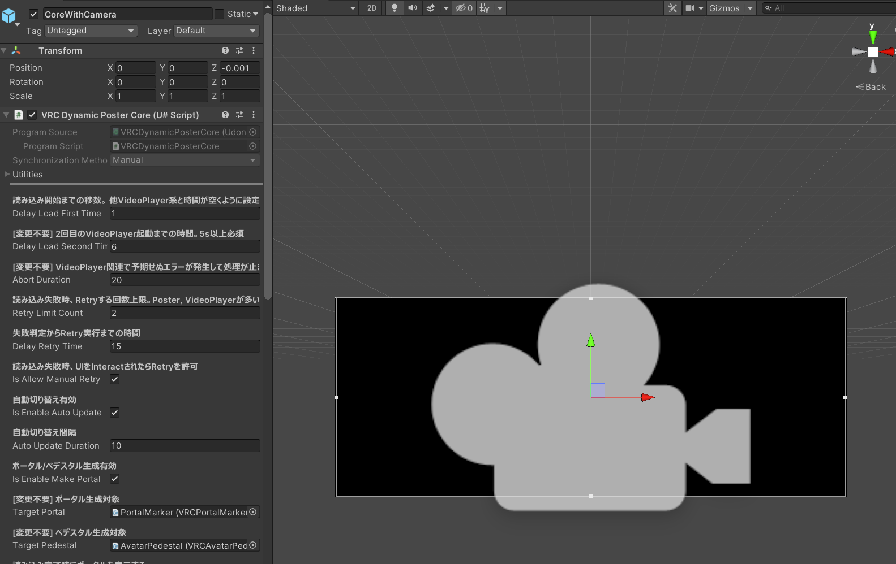

# VRCDynamicPosterPrefab

Unity を立ち上げずに内容編集できることを目指したワールド/パブリックアバター紹介ポスターです。

本リポジトリは、ワールドに配置するアセットです。VCC 対応済、Quest 動作確認済。

## 使い方

[shino-hinaduki/VRCDynamicPoster](https://github.com/shino-hinaduki/VRCDynamicPoster) が絡んでいて複雑そうな印象を与えていますが、 基本ポン置きして URL だけ修正すれば動きます。

1. UdonSharp 未導入の場合は追加します
1. VRCDynamicPosterPrefab.unitypackage を追加します
1. `Shinolab/VRCDynamicPosterPrefab/Prefab/VRCDynamicPosterPrefab.prefab` をシーン上に追加します
   - 
1. シーンに追加した Prefab の階層が折りたたまれていたら開きます
   - 
1. `UserObject` 配下のオブジェクトを設置したい場所に配置します
   - ポスター本体と、ポータル・ペデスタルを含んでいます
   - 位置関係が崩れない範囲であれば、個別に動かしても問題ないです
   - 
1. `System`下のオブジェクトが、他のオブジェクトと重なっている場合は _`System` の位置調整で_ ずらします
   - ワールド/アバター ID を変換した動画を再生し、それを Camera 撮影する役割持っています
   - 位置関係が崩れたり間に障害物があるとうまくカメラに映らなくなってしまう感じです
   - (Hierarchy 上でダブルクリックすると近い位置に飛べて便利です)
   - 
1. `System/CoreWithCamera`をクリックして Inspector を確認します
   1. 他の自動再生有効な VideoPlayer やポスターを配置している場合、読み込み開始の Delay を調整します
   1. VRChat の VideoPlayer の制約で、他 VideoPlayer の読み込みから 5 秒以上空ける必要があります
      - 
1. 一度 Unity 上で再生し、Scene/GameView 上でポスター内容が表示されることを確認します (確認後は再生は止めてもらって OK です)
   1. この時点で映らない場合、ここまでの手順もしくは環境に何かしらの問題がある可能性があります
   1. 動作時の進捗情報を `Debug.Log` に出しているので、こちらを確認ください
      - 
1. [shino-hinaduki/VRCDynamicPoster](https://github.com/shino-hinaduki/VRCDynamicPoster) から fork して自分独自の Poster/Avatar リストを作成し、その URL を控えておきます
   - 控えるのはリポジトリの URL ではなく、Github Pages で公開されている方です
     - 例: [https://shino-hinaduki.github.io/VRCDynamicPoster/](https://shino-hinaduki.github.io/VRCDynamicPoster/)
1. 再度`System/CoreWithCamera`をクリックして Inspector を確認します
   1. 末尾あたりにある URL を [shino-hinaduki/VRCDynamicPoster](https://github.com/shino-hinaduki/VRCDynamicPoster) を fork した自分の URL に差し替えます
      - URL には 2 種類あり、 `index.mp4` が白黒緑の映像、 `poster.mp4` がポスター画像を映像としてつなげた映像です
      - (トラブル時の切り分けのため、動作確認後の差し替えを推奨)
      - 
1. 一度 Unity 上で再生し、Scene/GameView 上でポスター内容が新規に設定した URL の内容に変更されていることを確認します

以上で対応は完了です。以後は fork した [shino-hinaduki/VRCDynamicPoster](https://github.com/shino-hinaduki/VRCDynamicPoster) を修正するだけでポスター内容を更新できます。

## 補足・制約事項

- ポスターごとに対応できる要素数は 128 エントリまでです。それ以上は動画生成時に切り捨てています
  - RenderTexture, Camera 画角, 生成側の上限数をいじれば手動で対応は可能ですが、Texture Size が大きくなります
- WorldId, AvatarId ではないエントリを混ぜた場合、暴走抑制のため動画の Parse を途中で打ち切ります

  - Camera 設置起因以外に Parse 失敗は基本想定していないため、ポスターは正常に表示できない可能性があります

- ポスター操作 UI の変更は比較的容易に行なえます。具体的には VRCDynamicPosterTrigger をつけたオブジェクトを `Interact` すると操作する仕組みです
  - `EventName` には `SyncUI`, `MoveNext`, `MovePrevious`, `TogglePortal` のいずれかを設定します
- 今後の VRChat, Udon, UdonSharp の更新次第では動作しなくなる可能性がありますがご了承下さい
